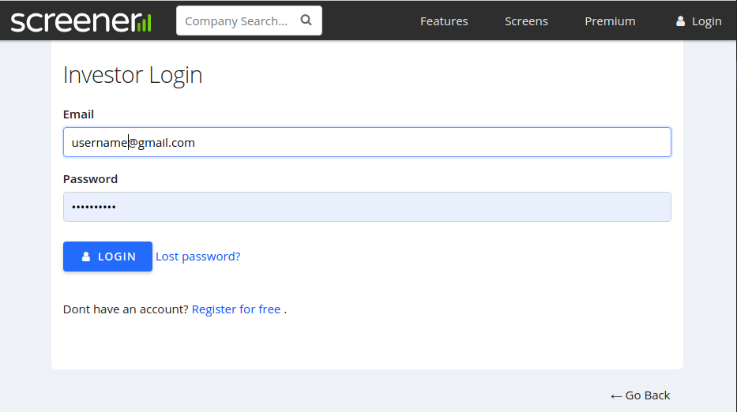
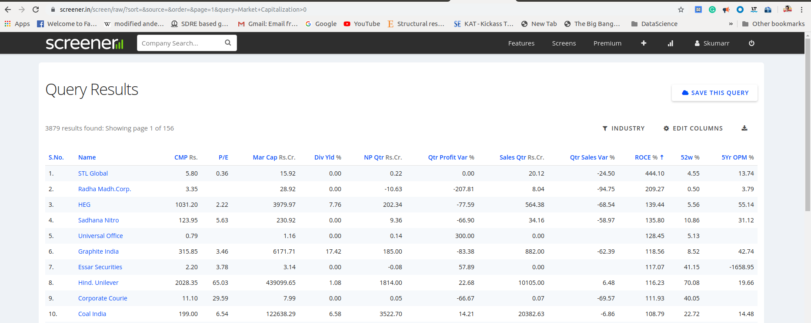
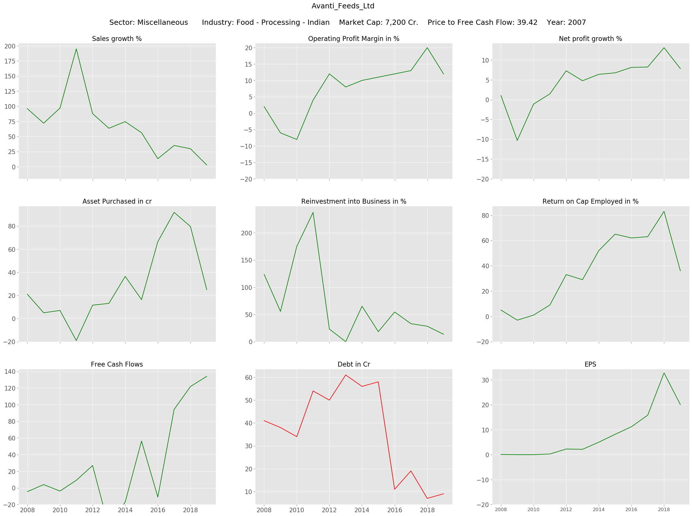
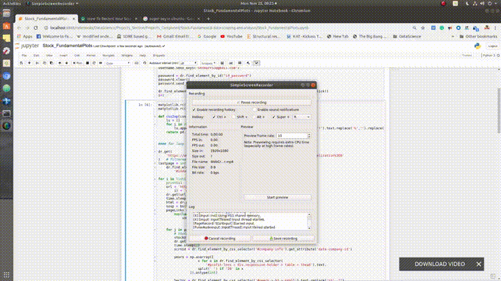

# Web Crawler for scraping Financial data  

- [Web Crawler for scraping Financial data](#web-crawler-for-scraping-financial-data)
  - [Problem Statement:](#problem-statement)
  - [Files Description](#files-description)
  - [Approach:](#approach)
  - [Requirements:](#requirements)
  - [Steps in  detail](#steps-in-detail)
    - [Login](#login)
    - [Iterating search results](#iterating-search-results)
    - [Plot Generation](#plot-generation)
  - [Technologies used](#technologies-used)
  - [Creator:](#creator)

## Problem Statement:

Stock investing, if done properly, yields better returns in the long run when compared to other conservative investment vehicles. Success comes from choosing stocks with solid fundamentals out of thousands. However, finding these stocks is as difficult as finding a unicorn. Picking a fundamentally sound stock involves investigating stocks from different angles such as evaluating fundamental ratios, company management analysis, product impact in the consumer market, about its competitors, and many more. Every step is crucial in deciding the stock we want to invest in and each part demands a substantial amount of time. So doing these steps on every stock listed is not a good idea. We have to choose only a handful of potential stocks based on certain criteria usually set on the performance of profitability indicators. Reviewing fundamentals of stock only at the current year does not reveal much and sometimes may also be misleading because for some reason the situation may be different in that financial year. Instead, we need to take a look at performance indicators over the past few years to get a clear picture of the company’s performance.

I took up this project to make the initial stocks screening process and the most important aspect i.e reviewing the trend of performance indicators for Indian companies. Reviewing company fundamentals involves understanding how well the company has performed over the past few years by looking at annual figures and also trends. Again, doing it manually is a hectic job as it involves collecting the list of stocks that meet our criteria, going over each stock page that is on our screened list, fetching historical data of performance indicators, and also plotting them to understand the trend. I decided to build a ‘web crawler’ in python that does all these tasks in one go. Just to summarize, the objective of this project is to choose the best value stocks on stocks screened based on criteria and reviewing the historical performance of these.

## Files Description

1. StockFundamentals_Scraper.ipynb - Ipython Notebook contains code that scrapes through the list of stock pages and collects the historical data for selected performance indicators
2. TrendPlots - Folder that contains the trend plots of performance indicators for sample of stocks stocks.

## Approach:

 This approach involves the following steps:
 1. Logging into a data provider server.
 2. Submitting the query that filters the stocks qualifying our criteria
 3. Collecting the stocks links storing in the list from the first page (if results are more than a page).
 4. Looping over stock link page and fetching required data, and simultaneously generating Plots for every link.
 5. Move to the next page and repeat steps 3-4 until it hits the last page.

## Requirements:
1. Python: the Web crawler is built in Python
2. Selenium: a tool that interacts with the webserver on the backend
3. Beautifulsoap: a package that helps to fetch data from HTML document
4. Numpy: Raw data which is text format is converted and stored in a numeric array format
5. Matplotlib: Plots Generation

## Steps in  detail
###  Login 

In this step, we initialize the selenium web driver and use that to log in to the web server by submitting our credentials. Screener.in is the data source and the Login link is provided below. https://www.screener.in/login/

Once we successfully get inside the server now we have access to the data. now we can run our query to filter the stock that passes our desired criteria. I have set a simple query that 'market capitalization > 0'. After running this query it lists out all the companies that have a market capitalization above zero. Below is the screenshot of the resulting page.

query link: https://www.screener.in/screen/raw/?sort=&source=&order=&page=1&query=Market+Capitalization%3E0

### Iterating search results

Notice that 3879 results passed the criteria set by us and they are stored across 156 pages. we need to insert the page number in the query link embedded at "&page=1&" to crawl across the pages 1-156 to get all the resulted stock links. Now, we are on page 1, let's collect all the stock page links and store them in the list. the links can be scraped by extracting 'href' tags associated with stock links using the 'bs4' package. We need to visit each stock page to source the data from it. It's done by creating beautifulsoup object of page, then locating tags that correspond to the data we are interested in and storing the data in an array format. below scroll over the example to get a glance at the web page.

The page contains several tables of historical data of parameters that describe the past performance and financial health of the company. But I have considered only a few indicators based on my intuition that decides the stability and profitability of a company in the competitive environment in the long run. You will see the selected indicators on the plot generated in a while.

### Plot Generation

Collecting just numbers won't tell much as it is difficult to interpret just looking at the number. we can create visual plots on the fly that tells the story about the company and may give hints on where it is heading in the future. Below I have added a trend plot of performance indicators for Avanti Feeds Ltd company as an example case. The company is mainly into aquacultural feed manufacturing business along with the production of value-added products of shrimps.

I will present here some of my insights about its management. Let's go over them.

1. Sales growth - The company has aggressively expanded its sales (>50%) but it dropped in recent years suggest that the company is close to attaining market saturation. But still, It has maintained above 25 % most of the financial years.
2. Operating profit Margin - company overall operating margin shows a positive trend. It signifies the difference between sales revenue and product manufacturing growing. Notice that there is a sharp rise in 2017 that can be attributed to a drop in raw materials price. Also, drop-in current years can be attributed to the rise in raw materials price above normal range upon doing some research.
3. Net profit growth - This has the same story as the above. The company Net profit margin in recent years is close to 8-9% which is a decent number. Company profit showing a positive trend is a good sign.
4. Asset Purchased - Asset purchase can be associated with business expansion or improvements such as replacing existing, entering into a new market segment or new business. A significant positive value indicates the company is growing.
5. Reinvestment into Business - Reinvestment into Business is almost the same as the previous one but expressed in the percentage of sales revenue. This will give a better picture of the company's growth. Suppose, there are two companies A and B of market capitalization 100 cr and 1000 cr. Both companies Reinvesting 10 cr into the business are not the same. A is expanding in business by 10% whereas B is expanding by only 1%. A is more aggressive when compared to B. The Avanti Feeds has maintained above 10% most of the years which is a good number for a company of this size.
6. Return on Capital employed - Idea is generally capital invested should yield higher percent returns or else the company is not making the best use of its resources. Its lose indicator need not be taken seriously because capital invested this year may not get converted into returns the same year but in the long run is yield good returns. So investors should focus long term trends rather than just numbers.
7. Free cash flows - It is the cash left with the company after deducting tax paid, capital expenditure and networking capital from earnings. This is the actual cash available to owners, shareholders, and lenders. Hence, This number more meaningful than net profit in terms of business returns and it forms the base input for stock price evaluation. Avanti Feeds has shown an increasing trend however actual number also matters.
8. Debt - Debt is one of the factors that decide the stability of the company if not keep under control may lead to the downfall of the company in a weak economy. An increasing trend tells that the company is struggling to meet its financial needs. This company is almost free from debt, which is good.
9. EPS - Earnings per share is the profit earned by shareholders per share. From 2011 onwards the EPS value is monotonically increasing till 2018 which means the investors have a positive sentiment towards the company and confident about the company's growth in the future. It seems likes a drop in the Sale growth and profit margins in the 2019 financial year may have negatively impacted EPS.  

These insights just scratch the surface there is more to it like understanding interactions between indicators give even better insights. Reading plots and developing a story is an art that can be mastered by practice and experience. It is advised to go over the past few year financial reports to know the actual reasons behind changes observed in plots.

Now we scraped data for the first company on the first page. this exercise has to be repeated for all the stock links on the first page, then move on to the second page and so on iteratively.

Let's put our webcrawler into action. For demonstration purpose I made to the crawler to login into the source, visit first three pages and in every page, its performs scraping on the first three stock pages, and log out from the source. Below is a clip of it.

## Technologies used

 

------
## Creator:

