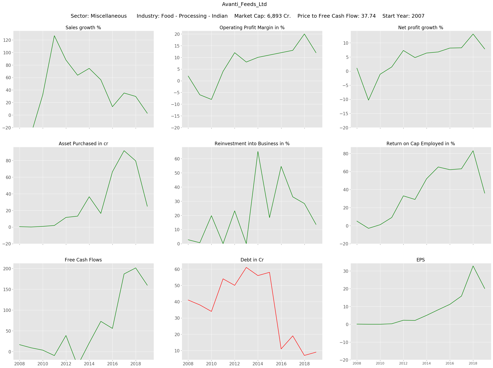

# Web Crawler for scraping Financial data  

## Problem Statement:

Stock investing, if done properly, yield better returns over long term when compared to other conservative investment vehicles . The success comes from choosing the stocks with solid fundamentals out of thousands. However, finding these stocks is as difficult as finding unicorn. Picking a fundamentally sound stock involves investigating stocks from different angles such as evaluating fundamental ratios, company management analysis, product impact in consumer market, about its competitors, and many more. Every step is crucial in deciding the stock we want to invest in and each part demands substantial amount of time. So doing these steps on every stock is not a good idea. We have to choose only a handful of potential stocks based on certain criteria usually set on performance indicators. But looking

This project tries to make initial stocks screening process and the most important aspect i.e reviewing trend of perfomance indicators easier. Reviewing company fundamentals involves understanding how well the company has performed over past few years by looking at annaual figures and also trend. Again, doing that manually is hectic job as it involves collecting list of list of stocks that meets our creteria, going over each stock page that is in our screened stock list, fetching historical data of performance indicators and maybe plotitng them to understand trend. So, I decided to build 'web crawler' in #python that does all this tasks at one go. Just to summarize, The objective of this project is to help users choose best value stocks that by allowing them to screen stocks based on criteria set by them and perform detailed historical performance review on the selected stocks.

## Files Description

1. Stock_FundamentalPlots.ipynb - Ipython Notebook that crawls through the list of stock pages and collects the historical data for selected performance indicators
2. Financials_Considered.txt - List of key indicators that are used for screening potential stocks.
3. Ratios_Descriptions.txt - Short description/defination about indicators.
4. TrendPlots - Folder that contains trend plot of indicators historical performance of stocks.
5. Stock_Screener - csv file that has list of stocks with indicators for current financial year that can used for stock screening
6. trenddata.pkl - pickle for that stores historical perfomance data of all companies

## Approch:

 This approch involves following steps:
 1. Logging into a data provider server.
 2. Submitting the query that filters the stocks qualifying our criteria
 3. Collecting the stocks links storing in list from the first page (if results are more than a page).
 4. Looping over stock link page and fetching required data, and simultaneously generating Plots for every link.
 5. Move to next page and repeat step 3-4 until it hits last page.

Requirements:
1. Python: the Web craweler is built in Python
2. Selenium: tool that interacts with web server on backend
3. Beautifulsoap: package that helps to fetch data form HTML docment
4. Numpy: Raw data which is text format is converted and stored in numeric array fromat
5. Matplotlib: Plots Generation

1. In this step we intialize the selenium webdriver and use that to log in into the web sever by submitting our credentials. Screener.in is the data source and Login link is provided below. https://www.screener.in/login/

2. Once we successfully get inside server now we have access to the data. now we can run our query to to filter the stock that pass our desired criteria. I have set simple query that 'market capitalization > 0'. After running this query it lists out all the companies that have market capitaization above zero. Below is the screenshot of resulting page.

query link: https://www.screener.in/screen/raw/?sort=&source=&order=&page=1&query=Market+Capitalization%3E0

Notice that there are 3879 results that passes the creteria set by us and they are stored across 156 pages. we need to insert the page number in the query link embeded at "&page=1&" to crawl across the pages 1-156 to get all the resulted stock links. For Now, we are in page 1, lets collect all the stock page links and store them in list. the links can be scraped by extracting 'href' tags associated with stock links using 'bs4' package. We need to visit each stock page to source the data from it. It's done by creating beautifulsoup object of page, then locating tags that corresponds to the data we are interested in and storing the data in array format. below scroll over the example to get glance of web page.

The page contains several tables of historial data of parameters that describes the past perfomance and financial health of the company. But I have considered only few indicators based on my intiuation that decides stabilty and profitability of a company inthe competative environment in the long run. You will see the selected indicators on the plot generated in a while.

Collecting just numbers won't tell much as it is difficult interpect just looking at number. we can create visual plots on the fly that tells the story about the company and may give hints on where it is heading in future. Below I have added one example case.

Scripts:
1. Stock_Fundamental_Data_Screener.ipynb - Financial ratios table
Stock_FundamentalPlots.ipynb - Plots of key parameters over time
Stock_FundamentalPlots.ipynb - Plots of key parameters over time
